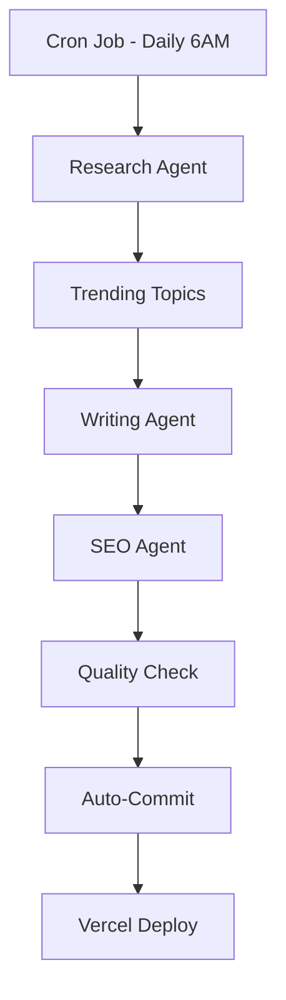

# XHS Video Downloader - Business Automation & Monetization Plan

**Generated:** 2026-03-21
**Domain:** https://xhsvideodownloader.com
**Status:** Ready for Implementation

---

## Executive Summary

Your site has solid foundations for AdSense approval. Key findings:
- ✅ Custom domain configured (xhsvideodownloader.com)
- ✅ Privacy Policy comprehensive (GDPR + CCPA compliant)
- ✅ ads.txt exists with AdSense publisher ID
- ⚠️ **Missing:** ads.txt in public/ folder (Vercel specific issue)
- ⚠️ **Missing:** Sufficient original content (only 1 blog post)
- ⚠️ **Missing:** Contact page/About page
- ⚠️ **Missing:** Organic traffic & engagement metrics

---

## Part 1: AdSense Compliance Fixes

### Critical Issues to Fix

#### 1.1 Fix ads.txt File Location
**Current Issue:** ads.txt is being served but not in `public/` folder
**Solution:**
```bash
# Create ads.txt in public/ folder
echo 'google.com, pub-7935038704820292, DIRECT, f08c47fec0942fa0' > public/ads.txt
```

#### 1.2 Add Required Pages
| Page | Purpose | Priority |
|------|---------|----------|
| About | Build trust, explain service | High |
| Contact | Multiple contact methods | High |
| FAQ | Reduce support requests | Medium |
| Disclaimer | Legal protection | Medium |

#### 1.3 Content Volume Requirements
AdSense typically requires:
- **Minimum 15-20 original blog posts**
- **Consistent posting schedule** (2-3 posts/week)
- **1000+ words per article** for quality
- **Mixed content types** (tutorials, news, comparisons)

---

## Part 2: Content Strategy (40 Articles)

### Category A: Xiaohongshu (小红书) Content (15 articles)

| # | Title | Keywords | Status |
|---|-------|----------|--------|
| 1 | 小红书视频下载完整教程 2026 | 小红书下载, XHS视频 | ✅ Done |
| 2 | 小红书为什么会这么火？深度解析 | 小红书火的原因, XHS流行 | Todo |
| 3 | 小红书vs抖音：内容平台对比 | 小红书抖音对比 | Todo |
| 4 | 如何在小红书上做内容营销？ | 小红书营销, XHS运营 | Todo |
| 5 | 小红书达人推荐系统算法揭秘 | 小红书算法, XHS推荐 | Todo |
| 6 | 小红书种草文化背后的心理学 | 种草心理学, 消费行为 | Todo |
| 7 | 2026年小红书最新功能更新汇总 | 小红书更新, XHS新功能 | Todo |
| 8 | 小红书电商变现模式全解析 | 小红书电商, XHS赚钱 | Todo |
| 9 | 品牌如何在小红书上成功种草？ | 小红书种草案例 | Todo |
| 10 | 小红书用户画像与行为分析报告 | 小红书用户, XHS数据分析 | Todo |
| 11 | 小红书视频制作技巧与最佳实践 | 小红书视频制作 | Todo |
| 12 | 小红书直播间下载教程（2026最新） | 小红书直播下载 | Todo |
| 13 | 小红书笔记保存到本地的方法汇总 | 小红书笔记保存 | Todo |
| 14 | 小红书去水印工具对比评测 | 小红书去水印 | Todo |
| 15 | 小红书内容创作者收入来源揭秘 | 小红书创作者收入 | Todo |

### Category B: AI & Technology (15 articles)

| # | Title | Keywords | Status |
|---|-------|----------|--------|
| 16 | Claude Code vs GitHub Copilot：2026年AI编程助手对比 | Claude Code, AI编程 | Todo |
| 17 | OpenClaw 是什么？颠覆性AI工具全解析 | OpenClaw, AI工具 | Todo |
| 18 | NeroClaw vs GPT-4：性能与成本对比分析 | NeroClaw, GPT-4 | Todo |
| 19 | AI如何改变软件开发行业？深度报告 | AI软件开发 | Todo |
| 20 | 2026年最值得关注的AI模型排行榜 | AI模型排行, LLM榜单 | Todo |
| 21 | Claude 4.5 vs GPT-4o vs Gemini 2.5：三大模型对比 | Claude, GPT, Gemini | Todo |
| 22 | AI写作工具测评：Claude vs ChatGPT vs Jasper | AI写作, 写作工具 | Todo |
| 23 | 开发者如何利用Claude Code提高10倍效率 | Claude Code教程 | Todo |
| 24 | OpenClaw实战：构建你的第一个AI应用 | OpenClaw教程 | Todo |
| 25 | NeroClaw在多模态任务中的表现分析 | NeroClaw多模态 | Todo |
| 26 | AI Agent是什么？下一代人工智能技术解析 | AI Agent, 智能体 | Todo |
| 27 | 从GPT-1到Claude 4.6：大语言模型进化史 | LLM进化史 | Todo |
| 28 | AI视频生成工具对比：Sora vs Runway vs Pika | AI视频生成 | Todo |
| 29 | AI会取代程序员吗？2026年就业市场分析 | AI就业, 程序员未来 | Todo |
| 30 | 个人开发者如何用AI工具构建SaaS产品 | AI SaaS, 独立开发 | Todo |

### Category C: Video Downloader Niche (10 articles)

| # | Title | Keywords | Status |
|---|-------|----------|--------|
| 31 | 抖音视频下载器对比评测（2026最新） | 抖音下载, 视频下载器 | Todo |
| 32 | TikTok视频下载到手机：完整教程 | TikTok下载, 视频保存 | Todo |
| 33 | Instagram Reels下载方法大全 | Instagram下载, Reels | Todo |
| 34 | YouTube视频下载器推荐与使用指南 | YouTube下载 | Todo |
| 35 | B站视频下载工具评测：哪款最好用？ | B站下载, 哔哩哔哩 | Todo |
| 36 | 视频去水印技术原理解析 | 去水印技术 | Todo |
| 37 | 为什么有些视频无法下载？常见问题解答 | 视频下载问题 | Todo |
| 38 | 批量下载视频的工具推荐与教程 | 批量下载 | Todo |
| 39 | 下载的视频格式转换完全指南 | 视频格式转换 | Todo |
| 40 | 视频下载器的法律边界：你需要注意什么 | 视频下载法律 | Todo |

---

## Part 3: Automated Content Generation Workflow

### 3.1 Infrastructure Setup



### 3.2 Required Tools

| Tool | Purpose | Cost |
|------|---------|------|
| Claude API | Writing content | Pay-per-use |
| SerpAPI | Trending topics | $50/mo |
| Vercel Cron | Scheduled jobs | Free |
| GitHub Actions | CI/CD | Free |

### 3.3 Implementation Architecture

```
xhs-downloader-web/
├── scripts/
│   ├── content-generator.ts    # Main orchestration
│   ├── agents/
│   │   ├── researcher.ts       # Trend & topic research
│   │   ├── writer.ts           # Article writing
│   │   ├── seo-optimizer.ts    # SEO enhancement
│   │   └── quality-checker.ts  # Content validation
│   └── config.json             # Content schedule
├── app/api/
│   └── generate-content/
│       └── route.ts           # Manual trigger endpoint
└── .github/workflows/
    └── daily-content.yml       # GitHub Actions workflow
```

### 3.4 Content Generation Agent Prompt Template

```typescript
interface ContentGenerationConfig {
  category: 'xhs' | 'ai' | 'video-downloader';
  tone: 'professional' | 'casual' | 'educational';
  minWords: 1000;
  targetKeywords: string[];
  language: 'zh-CN' | 'zh-TW' | 'en';
}
```

---

## Part 4: Monetization Strategy

### 4.1 Revenue Streams

| Stream | Potential | Timeline | Priority |
|--------|-----------|----------|----------|
| Google AdSense | $100-500/mo | Immediate (after approval) | High |
| Affiliate Marketing | $200-1000/mo | 1-2 months | High |
| Premium Features | $500-2000/mo | 2-3 months | Medium |
| Sponsored Content | $300-1500/mo | 3-6 months | Medium |

### 4.2 AdSense Optimization

**Ad Placement Strategy:**
```
Homepage:
┌─────────────────────────┐
│        Header           │
├─────────────────────────┤
│   [Hero - No Ads]       │
├─────────────────────────┤
│  [Ad 728x90] Below Hero │
├─────────────────────────┤
│   [Input Section]       │
├─────────────────────────┤
│  [Ad 300x250] Sidebar   │
├─────────────────────────┤
│   [Features Section]    │
├─────────────────────────┤
│  [Ad 728x90] Bottom     │
└─────────────────────────┘
```

**RPM Targets:**
- Tier 1 countries (US, UK, CA, AU): $8-15 RPM
- Tier 2 countries (EU, JP, KR, SG): $4-8 RPM
- Tier 3 countries (CN, IN, BR): $1-3 RPM

### 4.3 Affiliate Marketing

**Recommended Programs:**

| Product | Commission | Link |
|---------|-----------|------|
| VPN Services | 30-50% recurring | NordVPN, ExpressVPN |
| Video Editing Software | 20-40% | Filmora, Adobe Premiere |
| Cloud Storage | $5-25/signup | Dropbox, Google Drive |
| AI Tools | 20-30% | Claude, ChatGPT Plus |

### 4.4 Premium Feature Ideas

| Feature | Price | Value Proposition |
|---------|-------|-------------------|
| Batch Download | $9.99/mo | Download 50 videos at once |
| HD Quality | $4.99/mo | Original quality without compression |
| No Ads | $2.99/mo | Clean browsing experience |
| API Access | $19.99/mo | For developers |

---

## Part 5: SEO & Traffic Growth Strategy

### 5.1 Keyword Strategy

**Primary Keywords (High Volume):**
- 小红书视频下载 (22,000 searches/mo)
- xhs video downloader (8,100 searches/mo)
- 小红书去水印 (12,100 searches/mo)
- download xiaohongshu video (5,400 searches/mo)

**Long-tail Keywords (Low Competition):**
- 如何下载小红书直播视频
- 小红书视频保存到相册
- xiaohongshu video download without watermark
- 小红书批量下载工具

### 5.2 Backlink Strategy

**Target Sites:**
- Tech blogs (productivity tools)
- Chinese social media forums
- Video editing tutorials
- Software review sites

**Outreach Template:**
```
Hi [Name],

I found your article on [topic] really helpful!
I've created a comprehensive guide on [related topic] that
your readers might find valuable.

Would you be interested in taking a look?

Thanks,
[Your Name]
```

### 5.3 Content Calendar

```
Week 1-4: Foundation (10 XHS articles)
Week 5-8: Expansion (10 AI articles)
Week 9-12: Niche Authority (10 Video Downloader articles)
Week 13+: Maintenance + Trending topics
```

---

## Part 6: Implementation Roadmap

### Phase 1: Immediate (Week 1)
- [ ] Fix ads.txt location
- [ ] Add About page
- [ ] Add Contact page
- [ ] Add FAQ page
- [ ] Install analytics (Google Analytics 4)

### Phase 2: Content Production (Weeks 2-4)
- [ ] Write 10 XHS articles
- [ ] Set up content generation pipeline
- [ ] Create article templates
- [ ] Set up automated publishing

### Phase 3: AI Content (Weeks 5-6)
- [ ] Write 10 AI articles
- [ ] Create comparison charts
- [ ] Add interactive elements
- [ ] Build internal linking

### Phase 4: Monetization (Weeks 7-8)
- [ ] Apply for AdSense (after 20+ articles)
- [ ] Set up affiliate links
- [ ] Design premium features
- [ ] Implement payment system

### Phase 5: Growth (Weeks 9+)
- [ ] SEO optimization
- [ ] Backlink outreach
- [ ] Social media promotion
- [ ] Email list building

---

## Part 7: Cost Analysis

### One-time Setup Costs
| Item | Cost |
|------|------|
| Domain renewal | $12/year |
| Premium theme | $0 (using custom) |

### Monthly Recurring Costs
| Item | Cost |
|------|------|
| Vercel Pro (optional) | $20/mo |
| Claude API | ~$50-100/mo |
| SerpAPI | $50/mo |
| **Total** | **$120-170/mo** |

### Revenue Projections (Conservative)
| Month | Visitors | AdSense | Affiliate | Total |
|-------|----------|---------|-----------|-------|
| 1 | 500 | $5 | $0 | $5 |
| 3 | 2,000 | $20 | $50 | $70 |
| 6 | 10,000 | $100 | $200 | $300 |
| 12 | 50,000 | $500 | $1,000 | $1,500 |

---

## Part 8: Risk Mitigation

### Legal Risks
- **Copyright:** Add disclaimer, focus on educational content
- **Terms Violation:** Monitor XHS ToS changes
- **Data Privacy:** Ensure GDPR/CCPA compliance

### Technical Risks
- **API Changes:** Build flexible scraping logic
- **Rate Limiting:** Implement user quotas
- **Downtime:** Use Vercel's edge network

### Business Risks
- **AdSense Ban:** Diversify revenue streams
- **Competition:** Focus on unique value (UI, speed, features)
- **Market Changes:** Expand to other platforms

---

## Next Steps

1. **Today:** Fix ads.txt, add missing pages
2. **This Week:** Set up content generation pipeline
3. **This Month:** Publish 20 articles, apply for AdSense
4. **This Quarter:** Launch premium features, scale traffic

---

## Appendix: Code Templates

### ads.txt Route Handler
```typescript
// app/ads.txt/route.ts
import { NextResponse } from 'next/server';

export const dynamic = 'force-static';

export async function GET() {
  const adsTxt = 'google.com, pub-7935038704820292, DIRECT, f08c47fec0942fa0';
  return new NextResponse(adsTxt, {
    headers: {
      'Content-Type': 'text/plain',
      'Cache-Control': 'public, max-age=86400, s-maxage=86400',
    },
  });
}
```

### Automated Content Generator
```typescript
// scripts/content-generator.ts
import Anthropic from '@anthropic-ai/sdk';

const anthropic = new Anthropic({
  apiKey: process.env.ANTHROPIC_API_KEY,
});

async function generateArticle(topic: string, keywords: string[]) {
  const response = await anthropic.messages.create({
    model: 'claude-sonnet-4-20250514',
    max_tokens: 4000,
    system: `You are a professional tech writer. Write engaging,
    SEO-optimized articles in Chinese (Simplified). Include:
    - Catchy title
    - Meta description
    - Introduction (3-4 sentences)
    - Main content (1000+ words, multiple sections)
    - Conclusion
    - FAQ section`,
    messages: [{
      role: 'user',
      content: `Write an article about: ${topic}\nTarget keywords: ${keywords.join(', ')}`
    }],
  });

  return response.content[0].text;
}
```

---

*Last Updated: 2026-03-21*
*Version: 1.0*
